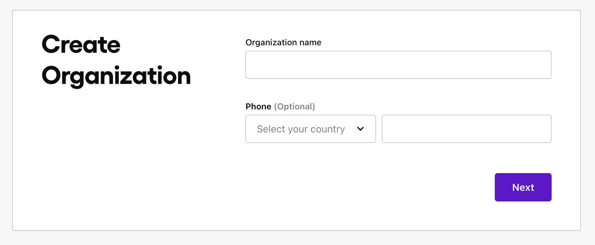
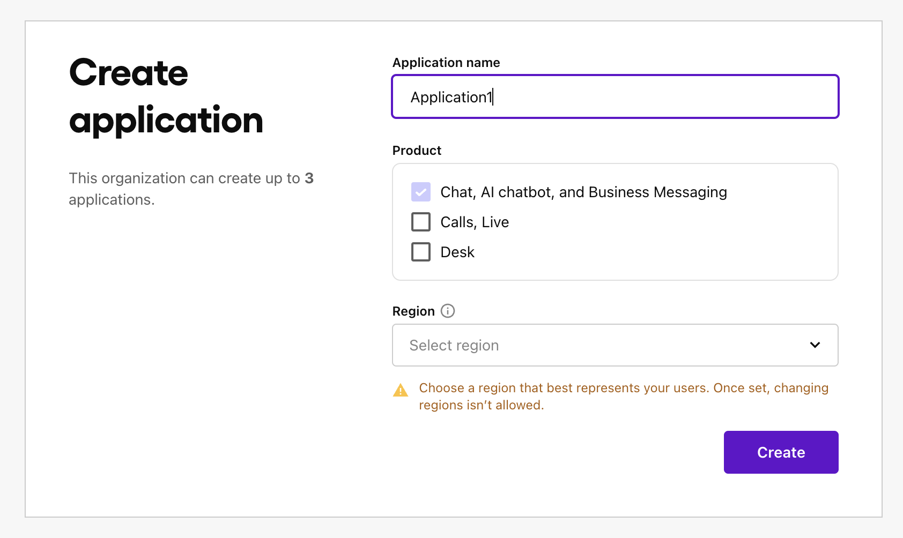

# Conversational Chatbot App


The Conversational Chatbot App is a chatbot app that can answer questions based on the knowledge base. 

## Features of the App

- **Conversation UI**: The app is designed to be used in a conversational way. This is a more natural way to interact with the app.
- **Voice UI**: The app will support voice commands. This is a more natural way to interact with the app.
- **Local caching**: The app will cache data locally. This will allow the app to work offline.

## Features of the Chatbot

- Knowledge Base: The chatbot can answer questions based on the knowledge base.
  - URL, File can be used as knowledge base.
- Supported various engines
  - GPT-4
  - Claude 3
  - Llama 2 70B
  - and more!
- Function calls : The chatbot can call functions (HTTP call) to get the answer.
- Response Workflow : custom response workflow can be defined

# Getting Started
## Prerequisites to use the App

- Sendbird Account
- Sendbird Application
- Sendbird Bot

### How to set up Sendbird
1. Go to [Sendbird](https://sendbird.com/products/ai-chatbot) and create an account.

2. Create an organization and an application.

<p align="center">
  
   
</p>

3. Create a bot. You can ingest the knowledge base.


4. Get the `APP_ID` in the [Dashboard](https://dashboard.sendbird.com/).

5. Enter the `Users` tab and create a user.


## How to use the App

### [Method 1] Build and Run the App
1. In the root directory, create a `secrets.properties` file.
2. Add the following properties to the `secrets.properties` file.
```
sendbirdAppId="YOUR_SENDBIRD_APP_ID"
sendbirdUserId="YOUR_SENDBIRD_USER_ID"
```
3. Run the app.

### [Method 2] Use the App
1. Install the apk file from the release.
2. Open the app.
3. Enter the `APP_ID` and `USER_ID` to the input fields.

